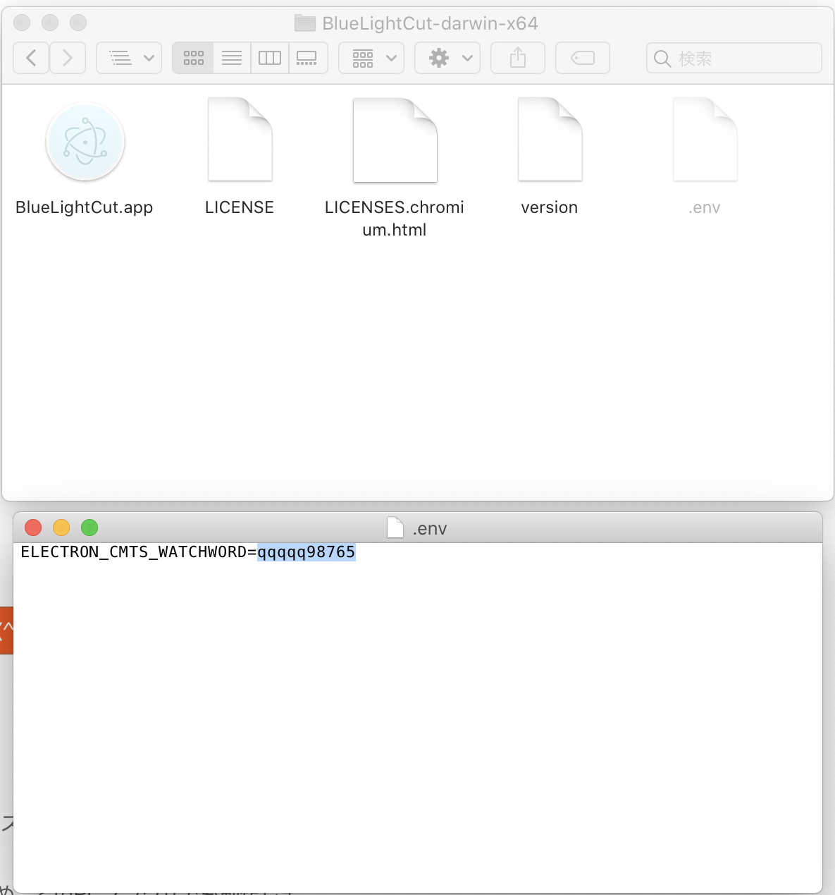
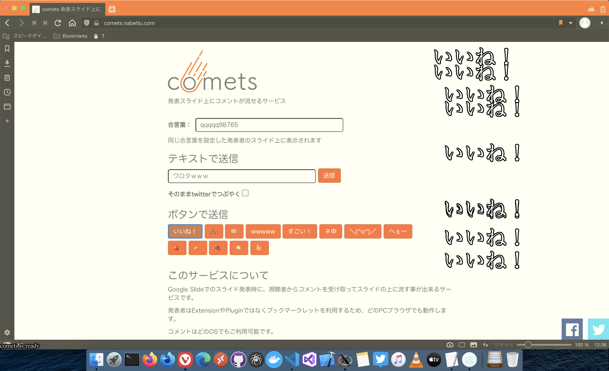

# Electron-cmts

---

## 使い方

- 合言葉を決める（例：qqqqq12345）
- [BlueLightCut.app](BlueLightCut-darwin-x64/BlueLightCut.app) と同じディレクトリにある設定ファイル[.env](BlueLightCut-darwin-x64/.env)に合言葉を設定する 
- [BlueLightCut.app](BlueLightCut-darwin-x64/BlueLightCut.app) を起動する
- ブルーライトカット状態になり、Ready メッセージが表示されるのを待つ
- URL [https://comets.nabettu.com/?id=＜合言葉＞](https://comets.nabettu.com/?id=qqqqq12345) を視聴者に共有する
- 
- 終了する時は Dock 上のアイコンから終了を選択する
